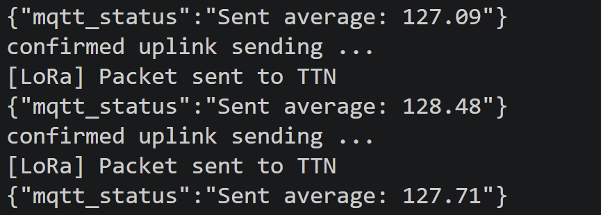
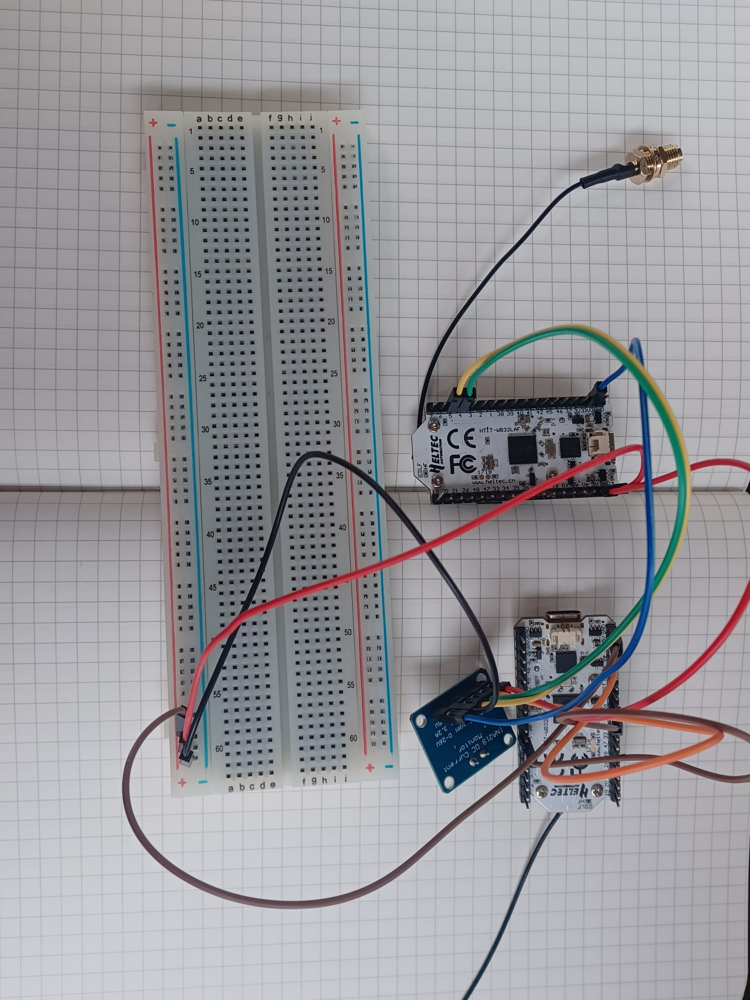
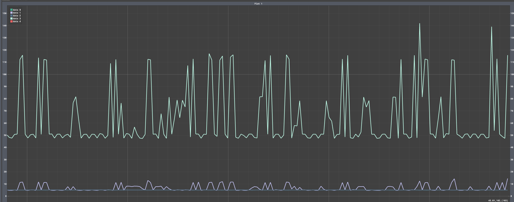
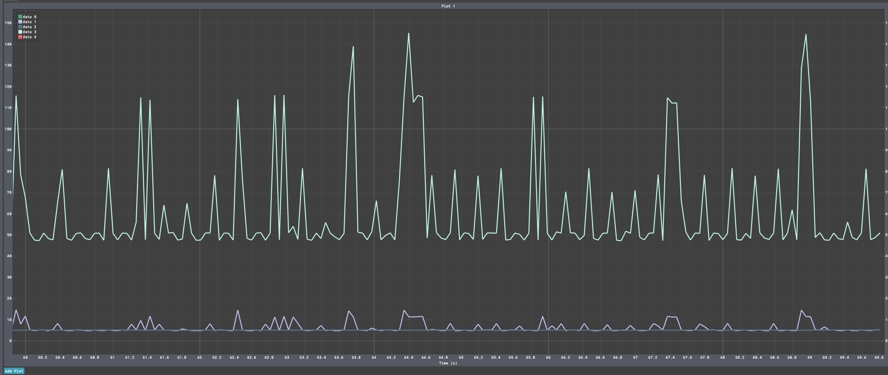

# Internet of Things: Individual Assignment

<!-- Badges: optional, you can remove or swap these. -->
<p align="center">
  
  
  
  
  
</p>

---

## Project info

| | |
|---|---|
| **Course** | Internet of Things |
| **Academic year** | 2025/2026 |
| **University** | Sapienza Università di Roma |
| **Instructors** | Prof. Andrea Vitaletti, Prof. Ioannis Chatzigiannakis |
| **Student** | Anja Škrlj |


## Overview

The goal of the assignment is to create an IoT system that collects information from a sensor, analyses the data locally and communicates to a nearby server an aggregated value of the sensor readings. The IoT system adapts the sampling frequency in order to save energy and reduce communication overhead. The IoT device will be based on an ESP32 prototype board and the firmware will be developed using the FreeRTOS. You are free to use IoT-Lab or real devices.

## Hardware 

2x Heltec LoRa Wifi ESP32 V3
1x INA 219
1x USB-c cable

For the sampling only 1 ESP32 is required (or a Wokwi simulation).
For energy consumption measurements, all 3 components are required.  

## Input signal 

The board I am using does not have a DAC. I am simulating this by a sine lookup table, writing the results at each point to a led pin (resolution 20 bits). 
The signal is to be of the form SUM(a_k*sin(f_k)). I have chosen for my primary experiment: 

```
input_signal(t) = 128 + 5*sin(2*pi*2*t)+11*sin(2*pi*12*t)
```

There are two more signals, elaborated on in the Bonus section.


## Maximum Sampling Frequency
Note, that we are not using a real sensor, so really the maximum frequency depends on the task clock - since I am using vTaskDelay(1), which means there is 1ms delay between taking samples, the maximum frequency should be 1000Hz. 

I also look at the actual sampling rate experimentally, by counting samples in the loop.

If we wanted to test the actual feasible maximum we can use yield() instead.  This way, the actual sampling frequency goes up to rouhgly 42kHz. However, this might stop other tasks so it is an unsafe way of sampling, if we want the same board to also do other things. 

## Identify optimal sampling frequency

I perform the FFT 6 times and take the average of the maximum frequencies found. Additionally, instead of multiplying the found frequency by 2 (as per the Nyquist theorem), I multiply it by 2.2.

For each bin, the threshold for the presence uses the Z-score:
$$\text{Threshold} = \text{mean} + 2 \times \text{std\_dev}$$ 

|Pass|Detected Max Frequency (Hz)|
|1|8.59 Hz|
|2|15.23 Hz|
|3|9.59 Hz|
|4|11.33 Hz|
|5|10.98 Hz|
|6|10.94 Hz|
|Average|11.11 Hz|

The sampler adapted to a sampling rate of 24.44Hz, which is in line with the theoretical ideal of 24Hz. 

## Compute aggregate function over a window

Aggregation is performed in a seperate task: TaskAggregation.
It calculates the average over a 5 second window of samples, then proceeds to sending the results. 

## Communicating the aggregate value

* Communication to the edge: Using MQTT over Wifi
* Communication to the cloud: Using LoRaWAN+TTN - the connection is established only once we have already performed the FFT and adapted the sampling rate. Ohterwise, it seemed to affect the FFT, possibly due to overloading the chip.

.

## Measure the performance of the system
### Energy 
Wiring 2 ESP32s + an INA 219 board, where 1 board is performing the sampling, communication and aggregation, and the other is reading the power and current readings given by the INA board. This is what the circuit looks like:



Since the sending is dependent on time, as opposed to number of samples, the result is actually really similar for both scenarios. 






Here, I get an unexpected result: the power consumption is actually really similar. 
In order to try and see a difference I calibrated the INA resolution, but it did not change the results. 

The possible reasons for the lack of difference are:
* The power supply is an USB connection to my laptop: the USB-to-UART bridge chip comsumes power and adds noise to the base current, masking small differences caused by frequency
* The communication is the power bottleneck, also masking the small difference caused by sampling 

### Per window execution 
This was measured by noting the time at the start of the aggregation, and printing the time elapsed once we have sent the aggregated data via WiFi. 

Both take around 2ms (including MQTT sending), with oversampling taking order of magnitude 0.1ms more on average. The aggregation is likely a much smaller part of the execution time compared to the MQTT communication. 

### Volume of Data
The data is transmitted per aggregated window - since the aggregation is done on a fixed window of time, the sampling rate has no effect on the volume of communicated data. 

By design, the 2 radios carry different payloads
* LoRa encodes the information on 4 binary bytes
* The JSON published by MQQT is roughly 20B + the protocol headers 

## Latency

I measued MQTT latencies by subscribing to my own topic and observing the timestamp differences. The latencies I saw were: 35 ms, 32 ms, 85 ms, 140 ms, 30 ms
Potentially more jitter, possibly because I used a public broker. 

With LoRa we expect bigger latencies, because of the class and frequency we are using (Class A, EU868)
After each uplink, the device opens two receive windows: 5s after sending and 6s after sending. 


## Bonus: Other signals
To try other signals, uncomment the different amplitude/frequency variables in main-sampler.cpp (20-35).

I first put through a signal with a large amplitude difference:
```
input_signal(t) = 128 + 1*sin(2*pi*23*t)+127*sin(2*pi*5*t)
```
As shown in the !(Input)[#input] section, I am using a dynamic threshold. Despite the large amplitude difference this found the correct maximum frequency, because the 1 amplitude is still within the std range of the mean. 
*Adapted to frequency:* 64.96 Hz

```
input_signal(t) = 128 + 9*sin(2*pi*43*t)+6*sin(2*pi*700*t)
```


It is constrained by FFT_SAMPLE_SIZE, which I have defined as 128 and the initial sampling frequency. My initial sampling frequency should be >200 to capture this signal correctly. 

## LLM Analysis 
In contrast to my approach, the LLM only does it using 2 tasks. 
Despite being given whole instructions, it does not produce code for connecting to WiFi and LoRa, but produces mostly correct code for the sampling, the FFT transform and the sampling noise filters. The communication could also be done if I employed further prompting. 
However, for the FFT it only finds the peak frequency, not the maximum represented frequency, which is incorrect for adjusting sampling frequency - could lead for undersampling. 
Other observations
* The LLM adds a 10% safety margin to the Nyquist Frequency.
* It uses mutexes, which are potentially overkill for this project, but are good practice 

## Setup
Clone this repository. I am running it in VSCode, using the platformIO and WOKWI plugins (Wokwi is only necessary in case that you want to run it on a simulated chip).
The dependencies are listed in the .ini file and will resolve when building the project using platformIO.

Monitoring the power consumption is not possible in the simulation - 2 ESP32 chips are required, one for running the code, the other for monitoring power consumption. 

To connect to WiFi, edit the WiFi configuration variables in main-sampler.cpp (96-100)
